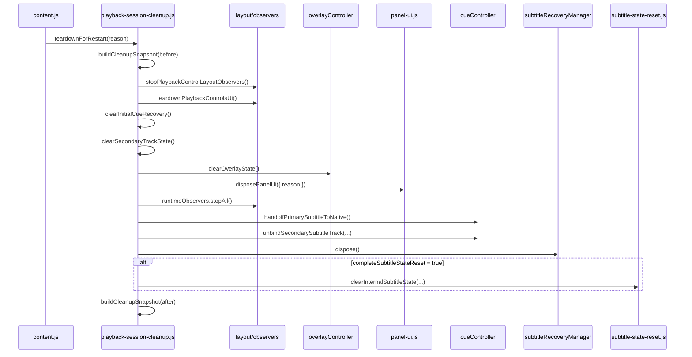
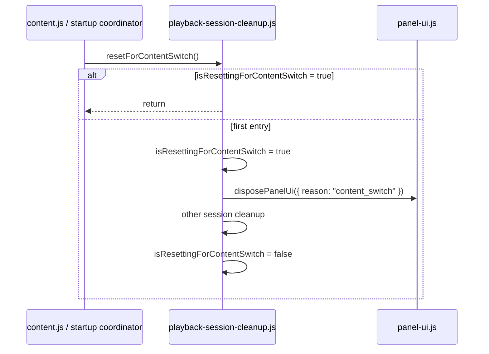
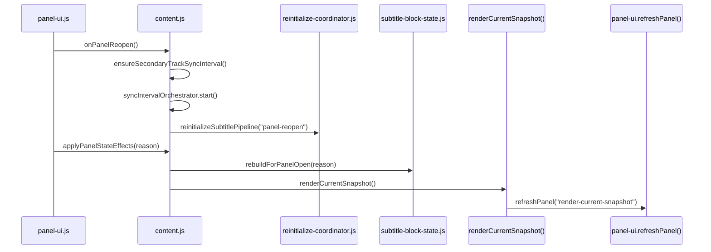
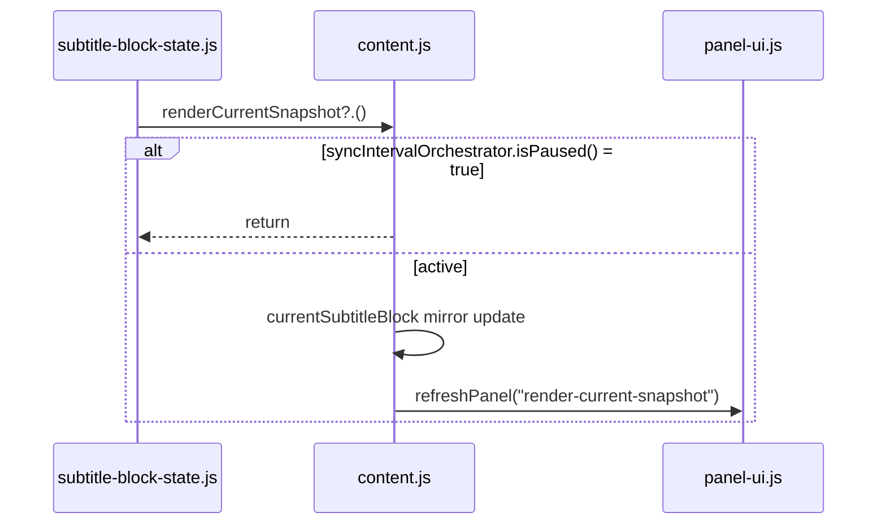

# Bugfix Step 17-A 方針整理メモ

対象ブランチ: `issue-32-content-core-split`  
対象ステップ: **Step 17-A: panel 系統合**

## 1. 目的

Step 17-A の目的は、panel に関する DOM参照・listener・observer・render snapshot・block state の owner を整理し、`content.js` から panel / blocks の実装詳細を外して、dispose 経路を明確にすることである。

今回の作業では、次を満たすことを完了条件とする。

- `content.js` に panel / blocks 実装詳細を残さない。
- `modules/panel-visibility-state.js` は panel 開閉 state の正本として維持し、DOM / render owner と混ぜない。
- panel host、shadow root、listener、observer、render snapshot、block state の owner と `dispose()` 経路を明確にする。
- Step 16 の builder 正本化、selection 共通化、decision 統合、pending task cancel、lane recovery state 命名整理を壊さない。
- `panelUi.dispose()` を panel 系 cleanup の高レベル入口として固定し、block state は subtitle 側 owner の責務として切り分ける。
- `applyPanelState()` と `refreshPanel()` の API 境界を固定し、Step 17-B / Step 18 へ渡す public surface を明確にする。

## 2. 現状整理

マスタープランでは、`content.js` に term inspector 関連 state / UI shell に加えて、subtitle panel / blocks 管理責務が残っていること、また panel 系実装が `panel-ui.js`、`panel-renderer.js`、`subtitle-blocks.js`、`subtitle-block-resolver.js` に分散したまま root 直下に残っていることが継続課題として整理されている。

現在確認できる panel 系主要関数は次の通りである。

### panel-ui.js

- `createPanelUi`
- `ensurePanelSlotLayerStyle`
- `buildPanelDebugShellHTML`
- `buildPanelShellHTML`
- `wirePanelHeaderActions`
- `createRightPanel`
- `createDebugPanel`
- `getPanelUiElements`
- `removeHost`
- `destroyFeatureUiHosts`
- `destroyUiHosts`
- `applyPanelVisibility`
- `togglePanel`
- `applyPanelState`
- `createToggleButton`
- `updateToggleButton`
- `loadPanelVisibility`
- `injectNativeToggle`
- `watchForPlayerTabs`

### panel-renderer.js

- `createPanelRenderer`
- `getSubtitleViewTexts`
- `getBlockTexts`
- `buildPanelBlockHtml`
- `bindPanelWordInteractions`
- `bindPanelBlockInteractions`
- `updatePanelRenderSnapshot`
- `scrollCurrentPanelBlockIntoView`
- `getAllPanelBlocks`
- `renderPanel`

### subtitle-blocks.js

- `toArray`
- `normalizeText`
- `buildSubtitleBlockKey`
- `classifyBlockState`
- `groupCues`
- `groupPrimaryCues`
- `buildSubtitleBlockFromGroups`
- `matchSecondaryText`
- `findNearestGroupAtTime`
- `analyzeSequenceHealth`
- `resolveCurrentIndex`
- `buildSubtitleBlockSequence`

### subtitle-block-resolver.js

- `normalizePanelBlocks`
- `groupBlocksByTimeWindow`
- `applySequentialCurrentWithinGroup`
- `resolveSingleCurrentBlock`
- `findPanelCurrentWindowKey`
- `applyPanelCurrentFlags`
- `dedupeLinesInOrder`
- `buildDisplayBlocksFromGroups`
- `resolvePanelBlocksForRender`

### modules/panel-visibility-state.js

- `load`
- `persist`

### content.js の Step 17-A 関連主要関数

- `renderSecondarySubtitle`
- `logSubtitlePanelState`
- `applyLayout`
- `persistPanelVisibility`
- `_refreshSettingsOnPanelOpen`
- `renderCurrentSnapshot`
- `getSubtitleBlockSequence`
- `getCurrentSubtitleBlockFromSequence`
- `applyPanelStateEffects`

## 3. 修正方針

### 3-1. owner 境界

Step 17-A では、panel 系責務を次の 4 層に分けて扱う。
この 4 層は panel 系の基本責務を切るための整理であり、後段の cleanup / reset owner 境界ではこれに `playback-session-cleanup.js`、`subtitle-state-reset.js`、`reinitialize-coordinator.js` などの高レベル orchestration を加えた到達経路として扱う。

1. **Visibility state**
   - `modules/panel-visibility-state.js`
   - panel 開閉 state の load / persist のみを持つ。
   - DOM・render snapshot・block state を持たせない。

2. **Panel owner**
   - `panel-ui.js` を中心とする。
   - panel host、shadow root、toggle button、header actions、observer、UI host cleanup、dispose 入口を持つ。

3. **Render owner / renderer**
   - `panel-renderer.js`
   - renderer は描画専用とし、入力 block 群を DOM へ反映する責務に寄せる。
   - lifecycle 判断や state 正本は持たせない。

4. **Block 計算 / block state**
   - `subtitle-blocks.js`
   - `subtitle-block-resolver.js`
   - `subtitle-blocks.js` は cue sequence 由来の block sequence 構築寄り。
   - `subtitle-block-resolver.js` は panel 表示用の block 形へ変換する計算寄り責務とする。

### 3-2. content.js に残す責務

`content.js` に残すのは、DI・起動シーケンス・高レベルイベント中継・owner 呼び出しだけに絞る。

残す責務:

- panel owner の生成
- visibility state の注入
- scene / snapshot / settings 更新時に panel owner へ入力を渡す
- teardown 時に `dispose()` を呼ぶ

外す責務:

- panel host / shadow root の直接保持
- panel DOM の組み立て
- block state の長期保持
- render snapshot の直接管理
- listener / observer の個別 cleanup
- panel 描画条件の詳細判断

### 3-3. dispose 契約

メモリーリーク対策として、panel 系 cleanup の入口を panel owner 側へまとめる。

固定した契約:

- `panel-visibility-state`
  - state の load / persist のみ
  - DOM cleanup は行わない。
- panel owner（`modules/panel-ui.js`）
  - `panelUi.dispose()` を panel 系 cleanup の高レベル入口として固定した。
  - panel host / ShadowRoot / toggle button / native toggle observer /
    resize listener / render timer / renderer owner state / render snapshot /
    overlay DOM を対称に破棄する。
  - 低レベルな DOM host 除去だけは `removeHost()` を内部利用して行う。
  - 再起動・拡張機能 OFF・content switch は
    `playback-session-cleanup.js` 経由で `panelUi.dispose()` に到達させる。
  - 手動再起動 cleanup は `content.js` から `panelUi.dispose()` を直接呼ぶ。
  - 冪等であり、host・observer・timer が未生成または既に破棄済みでも安全に完了する。
  - subtitle block sequence / current block / block meta などの block state は
    subtitle 側 owner の責務であり、`panelUi.dispose()` では破棄しない。
  - render snapshot の正本 owner は panel owner 側とし、通常の生成・保持・dispose は `modules/panel-ui.js` が担う。
  - ただし complete reset や restart 前整理では subtitle 側 state と表示内容の不整合を残さないため、subtitle state owner から snapshot clear を要求できるものとする。

- subtitle state owner
  - complete reset では block state と対応する render snapshot を同時に clear する。
  - restart 前の軽量整理では、panel DOM を維持する経路でも古い render snapshot を
    再利用しないよう `prepareForRestart()` で snapshot を明示的に clear する。
- `content.js`
  - DI・起動シーケンス・高レベルイベント中継に留める。
  - 個別の panel host / observer / timer / overlay cleanup を持たず、
    必要な入口から `panelUi.dispose()` を呼ぶ。

### 3-4. panel API 境界

Step 17-A-8 では、panel owner から外へ見せる高レベル API を次の 2 本に整理した。

- `panelUi.applyPanelState(reason)`
  - panel open 直後、mount 直後、再初期化完了後などに使う。
  - block 再構築を含む state effects を実行した後、panel renderer を反映する。
- `panelUi.refreshPanel(reason)`
  - 既存 state を前提に panel list を再描画するだけの API とする。
  - block 再構築や外部 effects は実行しない。
- `content.js`
  - renderer 実装を直接呼ばず、上記 panel API を高レベル中継として利用する。

## 4. 実装順序

Step 17-A は次の順序で進めており、17-A-8 と 17-A-9 まで完了済みである。現在の主作業は 17-A-10 である。

| 順序 | 枝番 | 目的 | 前提 | 状態 |
|---|---|---|---|---|
| 1 | 17-A-1 | panel / blocks の依存棚卸し | なし | 完了 |
| 2 | 17-A-2 | visibility 正本の固定 | 17-A-1 | 完了 |
| 3 | 17-A-3 | panel owner の再整理 | 17-A-1, 17-A-2 | 完了 |
| 4 | 17-A-4 | renderer 専用化 | 17-A-3 | 完了 |
| 5 | 17-A-5 | resolver の計算責務化 | 17-A-1, 17-A-4 | 完了 |
| 6 | 17-A-6 | block state owner の統合 | 17-A-5 | 完了 |
| 7 | 17-A-7 | `content.js` の薄化 | 17-A-2, 17-A-3, 17-A-4, 17-A-5, 17-A-6 | 完了 |
| 8 | 17-A-8 | dispose 契約の固定 | 17-A-3, 17-A-4, 17-A-6, 17-A-7 | 完了 |
| 9 | 17-A-9 | `modules/` 統合と `manifest.json` 整合 | 17-A-7, 17-A-8 | 完了 |
| 10 | 17-A-10 | Step 17-B / 18 へつなぐ API 固定 | 17-A-8, 17-A-9 | 進行中 |

## 5. 依存関係図

現在地は `17-A-10 API 境界固定` であり、dispose 契約固定と `modules/` 統合は完了済みである。

```text
17-A-1 依存棚卸し
   |
   +--> 17-A-2 visibility 正本
   |         |
   |         +--> 17-A-3 panel owner 再整理
   |                     |
   |                     +--> 17-A-4 renderer 専用化
   |                     |
   |                     +--> 17-A-5 resolver 計算責務化
   |                                   |
   |                                   +--> 17-A-6 block state 統合
   |                                                  |
   +--------------------------------------------------+
                                                      |
                                      17-A-7 content.js 薄化
                                                      |
                                      17-A-8 dispose 契約固定
                                                      |
                                      17-A-9 modules 統合 / manifest 整合
                                                      |
                                      17-A-10 API 境界固定
```

## 6. 枝番ごとの変更対象関数マッピング

### 17-A-1 依存棚卸し

- `panel-ui.js`
  - `createPanelUi`
  - `createRightPanel`
  - `applyPanelState`
  - `togglePanel`
- `panel-renderer.js`
  - `createPanelRenderer`
  - `renderPanel`
- `subtitle-blocks.js`
  - `buildSubtitleBlockSequence`
- `subtitle-block-resolver.js`
  - `resolvePanelBlocksForRender`
- `content.js`
  - `renderCurrentSnapshot`
  - `rebuildSubtitleBlocksForPanelOpen`
  - `renderSecondarySubtitle`

### 17-A-2 visibility 正本

- `modules/panel-visibility-state.js`
  - `load`
  - `persist`
- `panel-ui.js`
  - `loadPanelVisibility`
  - `applyPanelVisibility`
  - `togglePanel`
  - `applyPanelState`
- `content.js`
  - `persistPanelVisibility`

### 17-A-3 panel owner 再整理

- `panel-ui.js`
  - `createPanelUi`
  - `createRightPanel`
  - `wirePanelHeaderActions`
  - `createToggleButton`
- `content.js`
  - `createDebugPanel`
  - `applyLayout`
  - `renderSecondarySubtitle`

### 17-A-4 renderer 専用化

- `panel-renderer.js`
  - `createPanelRenderer`
  - `renderPanel`
  - `updatePanelRenderSnapshot`
- `panel-ui.js`
  - `createPanelUi`
- `content.js`
  - `renderCurrentSnapshot`

### 17-A-5 resolver 計算責務化

- `subtitle-block-resolver.js`
  - `resolvePanelBlocksForRender`
  - `buildDisplayBlocksFromGroups`
  - `applyPanelCurrentFlags`
- `panel-renderer.js`
  - `renderPanel`
- `content.js`
  - `renderCurrentSnapshot`

### 17-A-6 block state owner 統合

- `modules/subtitle-block-state.js`
  - `getSequence`
  - `setSequence`
  - `resolveCurrentBlock`
  - `syncCurrentBlockMirror`
  - `rebuildForPanelOpen`
- `subtitle-blocks.js`
  - `buildSubtitleBlockSequence`
- `content.js`
  - `getSubtitleBlockSequence`
  - `getCurrentSubtitleBlockFromSequence`
  - `setCurrentSubtitleBlock`
  - `rebuildSubtitleBlocksForPanelOpen`

### 17-A-7 `content.js` の薄化

- `content.js`
  - `renderCurrentSnapshot`
  - `renderSecondarySubtitle`
  - `applyLayout`
  - `logSubtitlePanelState`
- `panel-ui.js`
  - `createPanelUi`
  - `applyPanelState`
- `panel-renderer.js`
  - `createPanelRenderer`

### 17-A-8 dispose 契約の固定

- `modules/panel-ui.js`
  - `dispose`
  - `removeHost`
  - `applyPanelState`
  - `refreshPanel`
- `content.js`
  - restart cleanup 入口
  - panel cleanup 呼び出し
- `modules/playback-session-cleanup.js`
  - playback detach / content switch cleanup
- `modules/subtitle-state-reset.js`
  - complete reset / snapshot clear
- `reinitialize-coordinator.js`
  - 再初期化シーケンスと dispose 呼び出し順

### 17-A-9 `modules/` 統合と `manifest.json` 整合

- `manifest.json`
  - `content_scripts`
- `modules/panel-ui.js`
- `modules/panel-renderer.js`
- `modules/subtitle-blocks.js`
- `modules/subtitle-block-resolver.js`

### 17-A-10 Step 17-B / 18 へつなぐ API 固定

- `content.js`
  - `renderCurrentSnapshot`
  - `getSubtitleBlockSequence`
  - `getCurrentSubtitleBlockFromSequence`
  - `applyPanelStateEffects`
- `modules/panel-ui.js`
  - `applyPanelState`
  - `refreshPanel`
- `modules/subtitle-block-state.js`
  - sequence / current block API
- `docs/Bugfix/Step17-A_panel系統合_方針整理メモ.md`
  - visibility / lifecycle / term inspector への引き渡し条件

## 7. 進捗メモ（2026-08-26 更新）

### 17-A-8 で固定したこと

- `panelUi.dispose()` を panel 系 cleanup の高レベル入口として固定した。
- panel host、ShadowRoot、toggle button、native toggle observer、resize listener、render timer、render snapshot、renderer owner state、overlay DOM の cleanup owner を `modules/panel-ui.js` に寄せた。
- `removeHost()` は低レベルな DOM host 除去のみを担当し、`destroyUiHosts()` / `destroyFeatureUiHosts()` は `content.js` に残っていないことを確認した。
- 再起動・拡張機能 OFF・content switch は `modules/playback-session-cleanup.js` 経由、手動再起動 cleanup は `content.js` から、いずれも `panelUi.dispose()` に到達する経路として固定した。
- subtitle block sequence / current block / block meta などの block state は subtitle 側 owner の責務として残し、`panelUi.dispose()` では破棄しないことを明確にした。
- `applyPanelState()` は state effects を含む panel 状態再適用、`refreshPanel()` は既存 state に基づく render のみ、と API 契約を固定した。

### 17-A-10 API 到達経路整理

Step 17-A-10 では、`content.js` に残る panel / block 系 API を「高レベル中継」と「owner 内部 API」に分けて固定する。  
特に cleanup / reset / reinitialize の到達経路を API 名で追える状態にし、Step 17-B の visibility / lifecycle 整理で逆流しないようにする。

今回の確認結果では、到達経路は大きく次の 3 系統に分けて考えると分かりやすい。

- cleanup 系: `content.js` → `playback-session-cleanup.js` → 各 owner API
- panel reopen / reset 系: `panel-ui.js` / `content.js` → `reinitialize-coordinator.js` / `subtitle-block-state.js`
- block callback 再描画系: `subtitle-block-state.js` → `renderCurrentSnapshot()` → `panelUi.refreshPanel()`

### cleanup / reset の owner 境界

cleanup / reset まわりの owner は以下のように整理する。

| owner | 持つ責務 | 持たない責務 |
| :-- | :-- | :-- |
| `content.js` | DI、起動シーケンス、高レベル中継、restart / reopen 入口 | panel 内部 cleanup、block state の直接初期化詳細 |
| `modules/playback-session-cleanup.js` | cleanup 順序制御、owner API 呼び分け、再入ガード | panel render snapshot の直接 clear、panel DOM 内部操作 |
| `modules/panel-ui.js` | panel host / ShadowRoot / render snapshot / panel timer の cleanup | block state reset、subtitle pipeline 再初期化 |
| `modules/subtitle-block-state.js` | sequence / current block / meta / mirror の reset / rebuild | panel dispose、panel snapshot clear |
| `reinitialize-coordinator.js` | subtitle pipeline の再初期化順序制御 | panel owner / block owner の低レベル cleanup 詳細 |
| `modules/subtitle-state-reset.js` | subtitle 系 runtime state の complete reset | panel owner の dispose 代替 |

この境界により、cleanup module が panel owner の内部 state を直接書き換えず、owner API を順番に呼ぶだけの構造を維持する。

### cleanup 到達経路

restart / OFF / content switch の cleanup は、`playback-session-cleanup.js` の `runSessionTeardown()` を中心に片方向で流す。  
確認できた範囲では、主な順序は次のとおりである。

1. playback controls / layout observer を停止する
2. initial cue recovery を clear する
3. secondary track state を clear する
4. overlay state を clear する
5. `disposePanelUi()` 経由で `panelUi.dispose()` を呼ぶ
6. runtime observers を停止する
7. cue controller の native handoff / secondary unbind を行う
8. recovery manager を dispose する
9. complete reset が必要な場合だけ `clearInternalSubtitleState()` を呼ぶ

この順序は「外側の observer / timer 停止」→「panel UI 破棄」→「track / recovery 切断」→「必要時のみ subtitle state 全消去」となっており、cleanup 中の逆流を防ぎやすい。

#### restart cleanup sequence



#### content switch reset sequence

`resetForContentSwitch()` には `isResettingForContentSwitch` があり、同一タイミングでの同期的な再入を抑止する。  
そのため content switch cleanup は「最初の 1 回だけ進む」「2 回目以降は return する」というガード付きの流れになる。



### panel reopen / reset 到達経路

panel reopen は単なる panel 再描画ではなく、subtitle pipeline の再初期化を含む高レベル経路で扱う。  
確認できた範囲では、`panel-ui.js` の reopen 契機から `content.js` 側で sync interval 再開と `reinitializeSubtitlePipeline("panel-reopen")` を呼び、その後 `applyPanelStateEffects()` → `subtitleBlockState.rebuildForPanelOpen()` → `renderCurrentSnapshot()` → `panelUi.refreshPanel()` に流れる。



### block callback 再描画経路

`subtitle-block-state.js` は必要時に `renderCurrentSnapshot?.()` を callback し、`content.js` の `renderCurrentSnapshot()` は paused 中なら return、進める場合だけ mirror 更新と `panelUi.refreshPanel()` を実行する。  
これにより block owner から panel render owner への到達は維持しつつ、paused 中の不要な再描画を抑止できる。



### 循環依存を防ぐ整理方針

cleanup / reset / reinitialize の API 境界は、次の制約を守る。

- `panelUi.dispose()` は panel artifact clear 専用とし、block reset を呼ばない
- `subtitleBlockState` 側 reset / rebuild API は panel dispose を呼ばない
- `playback-session-cleanup.js` は owner API を順番に呼ぶ orchestration に留め、owner 内部 state を直書きしない
- `reinitialize-coordinator.js` は reopen / restart の高レベル入口だけを持ち、owner 内部 cleanup を持たない
- timer / pending task cancel は cleanup 冒頭へ寄せ、dispose 後 callback を残さない

この制約により、`dispose()`、block reset、reinitialize が互いを呼び返す構造ではなく、「高レベル orchestration → owner API → 必要時のみ高レベル再描画」という片方向性を維持する。

### 17-A-10 で固定する確認観点（cleanup / reset）

Step 17-A-10 の範囲では、実装変更の前に次を確認する。

- `playback-session-cleanup.js` から panel snapshot や panel DOM を直接 clear していないか
- `panel-ui.js` の `dispose()` が block reset API を呼んでいないか
- `subtitle-block-state.js` の rebuild / reset が panel dispose を呼んでいないか
- `renderCurrentSnapshot()` が paused / restarting 中に無条件で panel refresh へ進んでいないか
- `content switch` / `restart` / `panel reopen` の 3 経路で、timer / pending task cancel が先に走るか
- Step 17-B で visibility / lifecycle owner を追加しても、この順序図が崩れないか

### 17-B への引き渡し

Step 17-B では visibility / lifecycle owner を整理するが、cleanup / reset の順序そのものは Step 17-A-10 で固定した API 境界を前提に扱う。  
そのため 17-B では新しい cleanup 経路を増やすのではなく、既存の高レベル入口に visibility state を接続する方向で進める。

詳細は `docs/Bugfix/Step17-B_visibility-lifecycle_方針整理メモ.md` を正本とする。
